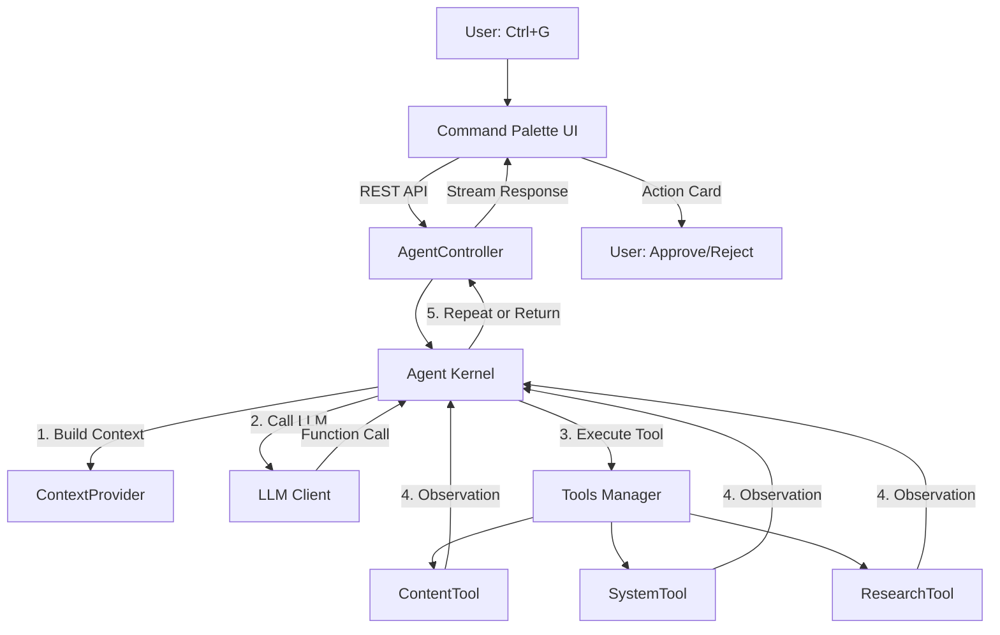

# WP Open Claw — AI Agent Plugin Implementation Plan

Plugin WordPress tự trị hoạt động theo vòng lặp **ReAct** (Reason + Act), cho phép AI thực thi hành động thật trên WordPress thông qua giao diện **Command Palette**.

## Decisions (Confirmed)

| Quyết định | Lựa chọn |
|---|---|
| LLM Provider mặc định | **OpenAI** (hỗ trợ thêm Anthropic) |
| Web Research API | **Google Custom Search** |
| Background Processing | **Action Scheduler** (thư viện chuẩn WooCommerce) |

---

## Architecture Overview



---

## File Structure

```
wp-content/plugins/wp-open-claw/
├── wp-open-claw.php              # Main plugin file
├── composer.json                 # PSR-4 autoload
├── uninstall.php                 # Cleanup on delete
├── PLAN.md                       # This tracking file
├── src/
│   ├── Activator.php
│   ├── Deactivator.php
│   ├── Agent/
│   │   ├── Kernel.php            # ReAct loop
│   │   └── ContextProvider.php   # Site snapshot
│   ├── LLM/
│   │   ├── ClientInterface.php
│   │   ├── OpenAIClient.php
│   │   └── AnthropicClient.php
│   ├── Tools/
│   │   ├── ToolInterface.php
│   │   └── Manager.php
│   ├── Actions/
│   │   ├── ContentTool.php
│   │   ├── SystemTool.php
│   │   └── ResearchTool.php
│   ├── REST/
│   │   └── AgentController.php
│   └── Admin/
│       ├── Settings.php
│       └── Dashboard.php
├── assets/
│   ├── css/
│   │   └── command-palette.css
│   └── js/
│       └── app.js
└── languages/
```

**Total: 18 new files**

---

## Components

### 1. Plugin Core
- `wp-open-claw.php` — Plugin header, constants, autoloader, hooks
- `composer.json` — PSR-4: `"OpenClaw\\": "src/"`
- `uninstall.php` — Cleanup on delete

### 2. Agent Core (ReAct Loop)
- `Kernel.php` — Vòng lặp ReAct: Reason → Act → Observe → Repeat (max 10 iterations)
- `ContextProvider.php` — Site snapshot (categories, post types, site info)

### 3. LLM Integration
- `ClientInterface.php` — `chat()` + `stream()` contract
- `OpenAIClient.php` — OpenAI API (gpt-4o) with function calling
- `AnthropicClient.php` — Anthropic API (Claude) with tool_use

### 4. Tools System (The Claw)
- `ToolInterface.php` — `getName()`, `getSchema()`, `execute()`, `requiresConfirmation()`
- `Manager.php` — Registry + dispatcher
- `ContentTool.php` — `wp_content_manager`: create/update posts via `wp_insert_post()`
- `SystemTool.php` — `wp_system_inspector`: categories, tags, plugins, site_info
- `ResearchTool.php` — `web_research_tool`: Google Custom Search API

### 5. REST API
- `AgentController.php` — `POST /open-claw/v1/agent/chat` (SSE) + `/agent/confirm`

### 6. Admin UI
- `Settings.php` — API keys, provider, model config
- `Dashboard.php` — Admin page, asset enqueuing (admin-only)

### 7. Frontend Assets
- `command-palette.css` — Glassmorphism overlay, action cards
- `app.js` — Ctrl+G toggle, SSE streaming, approve/reject

### 8. Activation/Deactivation
- `Activator.php` — Requirements check, defaults, capabilities
- `Deactivator.php` — Transient cleanup

---

## Security Checklist
- [x] `manage_options` capability check on all endpoints
- [x] Nonce verification via `X-WP-Nonce`
- [x] User confirmation required for write actions (ContentTool)
- [x] All inputs sanitized (`sanitize_text_field`, `wp_kses_post`, etc.)
- [x] All outputs escaped (`esc_html`, `esc_attr`, `esc_url`)
- [x] No frontend asset loading (AC3)
- [x] Prepared statements for any DB queries

---

## Acceptance Criteria
- **AC1**: "Viết một bài về Da Nang vào chuyên mục Du lịch" → Agent tự tìm Category, soạn nội dung, lưu draft
- **AC2**: Category không tồn tại → Agent nhận diện lỗi, đề xuất giải pháp
- **AC3**: Không ảnh hưởng tốc độ tải trang frontend

---

## Changelog

| Date | Change |
|---|---|
| 2026-03-13 | Initial plan created. Decisions: OpenAI, Google CSE, Action Scheduler |
